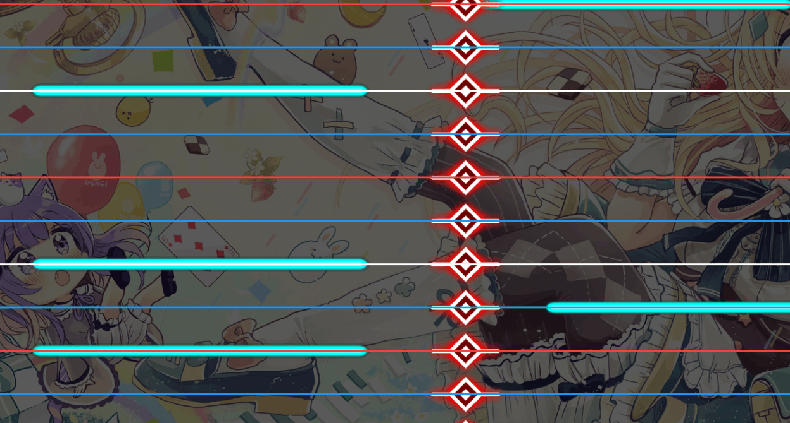

# Changelog

This page contains detailed release notes and related instructions for DyNode updates.

## [v0.1.17.3](https://github.com/NordLandeW/DyNode/releases/tag/v0.1.17.3) (2025-05-07)

This release includes several bug fixes.

* Fixed an issue where background videos failed to play properly.
  * Rolled back the Gamemaker Runtime to version 2024.8.
* Fixed a crash caused by unknown difficulty symbols in XML files.
* Temporarily removed the background blur effect.

## [v0.1.17.2](https://github.com/NordLandeW/DyNode/releases/tag/v0.1.17.2) (2025-03-07)

This version includes important stability improvements and bug fixes.

- Significantly improved the reliability of project saving.  
- Fixed an occasional issue where saving a project resulted in an empty file, causing project progress loss.  
  - This issue was caused by an external library, occurring randomly with an unknown cause.

## [v0.1.17.1](https://github.com/NordLandeW/DyNode/releases/tag/v0.1.17.1) (2025-02-27)

This version includes several bug fixes.

* Fixed multiple issues where double-tap snapping note input was incorrectly cleared.  
* Updated the compression library (Zstandard) to version 1.5.7.  
* Replaced several links.

## [v0.1.17](https://github.com/NordLandeW/DyNode/releases/tag/v0.1.17) (2025-02-22)

This release includes feature adjustments and bug fixes.

- You can now invert the selection for individual notes.
- Added a setting to configure the project’s compression level.
- The toggle for enabling or disabling particle effects has been moved to the global settings.
- Fixed an issue where particle effects would be out of sync at different frame rates.
- Improved error handling and stability when saving projects.
- Fixed a formatting issue in the English language interface.
- Fixed an issue where file corruption during updates would halt the update process.
- Refactored the XML chart import process to enhance efficiency.

## [v0.1.16.10](https://github.com/NordLandeW/DyNode/releases/tag/v0.1.16.10) (2024-12-29)

This version includes several bug fixes and feature adjustments.

* The up arrow key now only toggles between dual-sided and front.
* Fixed an issue where quick duplication ignored the tail timing of Hold notes.
* Fixed an error that occurred when reopening a project after auto‐saving in snap/copy mode.
  * If the project is currently in snap mode, the current auto‐save will now be skipped.
* Fixed a potential memory leak issue.

## [v0.1.16.9](https://github.com/NordLandeW/DyNode/releases/tag/v0.1.16.9) (2024-12-13)

This version includes several feature adjustments, bug fixes, and localization updates.

* **Localization updates:**
  * Updated the translation texts for English and Traditional Chinese.
  * Added Japanese language.
* Removed some incorrect bar-number snap information for notes in certain cases.
* Adjusted the visual display when snapping notes.
* You can now use Alt + mouse wheel to quickly adjust the snap‐center note when snapping.
* Adjusted the movement logic of the Mixer.
* Made the disappearance of Hold note tails visually consistent with the original.

## [v0.1.16.8](https://github.com/NordLandeW/DyNode/releases/tag/v0.1.16.8) (2024-11-25)

This version includes several bug fixes.

* Fixed an issue where, in some cases, moving the mouse to the top edge of the screen in fullscreen mode failed to adjust the time.
* Fixed an issue where auto‐update did not work properly when the path contained Chinese characters.
* Fixed an issue where auto‐saving occurred even when no chart was loaded.
* Removed forced refresh rate synchronization under VSync.

## [v0.1.16.7](https://github.com/NordLandeW/DyNode/releases/tag/v0.1.16.7) (2024-11-10)

This version includes several bug fixes.

* Fixed abnormal behavior when adjusting note lengths while placing notes.
* Fixed an issue where, under certain circumstances, music might be played repeatedly after the end.

## [v0.1.16.5](https://github.com/NordLandeW/DyNode/releases/tag/v0.1.16.5) (2024-10-29)

This version includes some bug fixes and feature adjustments.

* Added the ability to delete all notes using the <kbd>Backspace + Delete</kbd> key combination.
* Fixed an error when importing .dy files.
* Removed the transitional animation for KPS.

## [v0.1.16.4](https://github.com/NordLandeW/DyNode/releases/tag/v0.1.16.4) (2024-10-12)

This version includes several bug fixes.

* Fixed an issue where, during quick duplication, notes could not snap to off‐screen beat lines.
* Fixed an issue where input state was not properly cleared in some cases.

## [v0.1.16.3](https://github.com/NordLandeW/DyNode/releases/tag/v0.1.16.3) (2024-09-18)

This version includes several bug fixes.

* Fixed an issue where .dyn files could not be imported correctly.
* Fixed a crash caused by chart information not being completely cleared during import.

## [v0.1.16.2](https://github.com/NordLandeW/DyNode/releases/tag/v0.1.16.2) (2024-08-30)

This version includes several bug fixes.

* Fixed an occasional crash at startup.
* Fixed an issue where frequent IO clearing caused function key inputs to be lost.

## [v0.1.16.1](https://github.com/NordLandeW/DyNode/releases/tag/v0.1.16.1) (2024-08-09)

This version includes one bug fix.

* Fixed an issue where creating a Timing Point after selecting a note caused a crash.
  * This could lead to the game crashing.
  * It might be mistakenly regarded as modifying a Timing Point.

## [v0.1.16](https://github.com/NordLandeW/DyNode/releases/tag/v0.1.16) (2024-08-03)

This version includes performance optimizations and bug fixes.

* Greatly improved smoothness when saving larger projects.
* Improved overall editing efficiency for larger projects.
* Projects from older versions will now be automatically backed up when loaded in a new version.
* Improved several input‐related issues.
  * The editor will no longer read function keys like Ctrl or Alt when the window is not in focus.
* The shortcut for showing all notes has been moved to the right Alt key.
* Auto‐save reminders will not be shown during playback mode.
* Removed some unnecessary information from project files.
* Improved the advanced expression feature.
* Added data collection functionality.
  * See [Getting Started](guide/getting-started.md) for details.

## [v0.1.15](https://github.com/NordLandeW/DyNode/releases/tag/v0.1.15) (2024-07-25)

This version includes new features and several bug fixes.

* Fixed an issue where auto‐update did not work properly when the installation path contained spaces.
* Reduced the size of project files.
  * Because .dyn files now use a new saving method, earlier versions cannot read .dyn files saved in this version.
* Auto‐save now backs up projects.
* You can now use <kbd>Ctrl+D</kbd> to quickly duplicate notes to the next beat.
* Fixed some outdated error messages.
* Fixed an issue where reminder intervals were sometimes too long.
* When VSync is enabled, the maximum FPS is now locked to the screen refresh rate.
* Several other improvements.

## [v0.1.14](https://github.com/NordLandeW/DyNode/releases/tag/v0.1.14) (2024-07-22)

This version includes new features, bug fixes, and performance improvements.

### New Features

* Added new functions to the statistics page:
  * Project duration
  * KPS statistics
  * Current BPM display
* Added a "Save As" function.
  * Use <kbd>Ctrl+Shift+S</kbd> to save a project under a new name.
* Added auto‐update functionality.
  * You can now directly receive updates within DyNode.
* Optimized the descriptions for undo/redo actions.
  * Action descriptions are now more specific.
* The "Select All" function now only applies to notes visible on the screen.
* The export function to Dynamaker format has been moved to <kbd>F6</kbd>.
* Added two new configuration options:
  * `autoSaveTime` to adjust the auto‐save interval. The new default is 180 seconds.
  * `VIDEO_UPDATE_FREQUENCY` to adjust the video playback refresh rate. The new default is 60Hz.

### Bug Fixes

* Temporarily alleviated a serious memory leak issue caused by some global undo operations.

### Performance Optimizations / Miscellaneous

* Optimized performance when saving projects.
* Removed configuration reloading functionality.

## [v0.1.13.4](https://github.com/NordLandeW/DyNode/releases/tag/v0.1.13.4) (2024-05-12)

This version includes a few minor bug fixes.

* Fixed an issue where, under rare circumstances, precision loss could cause notes on the left and right at the same time to be misaligned.
* Fixed an issue where the error correction function might ignore notes at the end of a chart.
* Added the `offsetCorrection` configuration for the error correction function, allowing you to adjust the correction range.
* Updated the Gamemaker Runtime version to 2024.4.

## [v0.1.13.3](https://github.com/NordLandeW/DyNode/releases/tag/v0.1.13.3) (2024-04-12)

This version includes several bug fixes.

* Fixed an issue in dual‐sided editing mode where pasted notes might not be synchronized on the falling side.
* Improved the warning for notes going off‐screen.
  * Now notes are only warned if they are completely invisible.
  * Fixed an issue where the off‐screen warning was repeatedly triggered.
* Fixed a potential crash caused by cutting/snap notes.
* The default setting for MP3 file music delay (FMOD_MP3_DELAY) has now been changed to 0.
  * This change only affects new installations of DyNode.
* Fixed several potential issues related to video playback.
* Updated the Gamemaker Runtime version to 2024.2.

## [v0.1.13.2](https://github.com/NordLandeW/DyNode/releases/tag/v0.1.13.2) (2024-02-21)

This version includes some minor bug fixes and optimizations.

* Optimized the threshold handling for dragging to adjust note widths. Now, the width change calculation only begins after the threshold is triggered.
* You can now modify the threshold for note width adjustment in the configuration file.
* Fixed an issue where importing older Dynamaker chart files could cause a crash.
* Starting from this version, auto‐update prompts for each version will only appear once.

## [v0.1.13.1](https://github.com/NordLandeW/DyNode/releases/tag/v0.1.13.1) (2024-01-28)

This version includes one bug fix.

* Fixed an issue where dragging the tail of a Hold note caused the game to crash.

## [v0.1.13](https://github.com/NordLandeW/DyNode/releases/tag/v0.1.13) (2024-01-23)

This version includes new features and bug fixes.

### New Features

* Added functions for modifying and correcting Timing. See [Timing/Modify Timing Point](guide/timing.html#modify-timing-point) and [Timing/Timing Correction](guide/timing.html#timing-correction) for details.
* Now supports multi‐selecting notes on different sides and batch operations on them. See [Chart Editing/Multi-select Across Sides](guide/edit.html#multi-select-across-sides) for details.
* Now supports simultaneous editing of notes on both left and right sides. See [Chart Editing/Dual-sided Editing](guide/edit.html#dual-sided-editing) for details.
* Toggling between bar number and time display now shows accurate bar numbers. See [Timing/Time and Bar Number](guide/timing.html#time-and-bar-number) for details.
* In the visually consistent default width mode, pasted/snapped notes will automatically adjust their width.
* Added support for importing the .dy chart format.
* Now, settings for particle effects are saved within the project.
* Holding <kbd>Shift</kbd> now accelerates adjustments made with <kbd>A/D</kbd>.
* Adjusting note width during paste will no longer reset the note's width.
  * You can still manually reset it using <kbd>Ctrl+V</kbd>.
* You can now hold the <kbd>Alt</kbd> key to display information for all notes.
* A threshold for triggering width adjustment when placing notes has been added.
  * This helps avoid accidental width adjustments when placing notes.

### Localization

* Supplemented/improved the English translations.

### Bug Fixes and Improvements

* Fixed an issue where low frame rates caused incorrect IO clearing.
* Added warnings and fixed related crashes when importing early Dynamaker chart files.
* Corrected and improved several transition animations.
  * Avoided unnecessary transitions.
  * Fixed some unnatural flickering.
* Fixed some multilingual issues.
* Several other improvements.

### Feature Removals

* Removed the option to manually modify Bar settings.
  * Removed global Bar/Offset settings.
  * Removed warning messages after overriding Bar settings.

### Documentation

* Documentation will now be cached locally, so it can be accessed offline.
* You can now perform online searches within the documentation from the upper right corner.
* Multiple entries have been updated and corrected.

## [v0.1.12.5](https://github.com/NordLandeW/DyNode/releases/tag/v0.1.12.5) (2024-01-03)

This version includes some bug fixes.

* Fixed an issue where the Chain note texture was missing pixels.
* The transition animations will now behave consistently across different frame rates.
  * (Excluding particle animations.)
* Fixed a potential issue where videos could not play properly.
* Updated the Gamemaker Runtime to v2023.11.1.160.
  * This update brings some bug fixes and efficiency improvements.

## [v0.1.12.4](https://github.com/NordLandeW/DyNode/releases/tag/v0.1.12.4) (2023-11-24)

This version includes some bug fixes and feature changes.

### Bug Fixes

* Fixed an issue where the English left bracket `[` could not be displayed correctly in titles.
* Fixed an issue where the game would fail to start if DyCore.dll could not be loaded on older systems.
* Fixed an issue where pressing `Ctrl+C` in copy mode caused a crash.
* Fixed potential crash issues related to video playback.
* Fixed an issue where IO was not cleared properly when the window lost focus due to a high time threshold.
* Removed the libfilesystem extension to attempt to fix some related issues.

### Feature Changes

* When creating a new project, the default beat line opacities are now 50%, 0%, 0% (front, left, right).
* The beat line opacity settings for a project are now saved.
* Optimized the Mixer's handling of multi‐taps.
* The export function for Dynamaker‐modified has been moved to the shortcut <kbd>Ctrl+F5</kbd>.
* When multi‐selecting notes, a highlighted center point for dragging will appear.
* Fixed an issue with the priority selection of the drag center point when multi‐selecting notes.
* Now, the position highlight for notes on both sides will be displayed simultaneously.

## [v0.1.12.3](https://github.com/NordLandeW/DyNode/releases/tag/v0.1.12.3) (2023-09-05)

This version includes some bug fixes and new features.

### Bug Fixes

* Attempted to fix an issue where deleting notes could cause the game to crash.
* Fixed an issue where the music volume was reset after the music finished playing.
* Fixed an issue where the background lighting sometimes remained static.

### Visual Improvements

* Redesigned the layout of the score board and made related visual adjustments to more closely resemble the original Dynamix.
* Optimized the text display in the TAB toolbar.

### New Features

* Notes at the same timestamp will now be highlighted with a block.
* You can now double‐click a snapped note.
  * The double‐clicked note becomes the snap center.
    
* The error correction function now replaces the millisecond rounding function.
  * By default, consecutive notes within a 2ms error will be aligned to the earliest note in that group.
* Added an experimental option to disable pitch change in the TAB toolbar.
  :::warning
  The current experimental disable‐pitch option will significantly increase audio delay and may have many underlying issues.
  :::
* Project‐related files will now be copied to the project’s directory when saving, and by default files are read using relative paths.
  * These related files include music, background, and video files.
  :::warning
  The project file format in this version will break compatibility with older versions. Please back up your project files as needed before updating.
  :::

### Miscellaneous

* Updated the Gamemaker Runtime version to 2023.6.

## [v0.1.12.2](https://github.com/NordLandeW/DyNode/releases/tag/v0.1.12.2) (2023-07-05)

This version includes some bug fixes.

* Removed an external library, thereby fixing several issues it caused, such as:
  * OBS not being able to capture DyNode’s screen via game recording.
  * The game slowing down when clicking on the game screen while a dialog is open.
  * DyNode in the foreground being recognized by Windows as a background application.
  * Some unexplained stuttering issues.
* Fixed an issue where a "NOTE DELETE ERROR" crash caused the game to terminate.
* Updated the Gamemaker Runtime to 2023.6.

## [v0.1.12.1](https://github.com/NordLandeW/DyNode/releases/tag/v0.1.12.1) (2023-06-17)

This version fixes a major issue from v0.1.12 which could cause exported charts to be unreadable.

* Fixed an issue with the XML parser that could cause exported charts to occasionally be unreadable.
  * The issue was due to an incorrect order of the version and encoding attributes in the XML Declaration on the first line of the XML file. The correct format should be `<?xml version="1.0" encoding="UTF-8"?>`, but DyNode’s XML parser might output it as `<?xml encoding="UTF-8" version="1.0"?>`.
  * This issue may have occurred since v0.1.11.5.
  * Removed the encoding attribute from the XML Declaration.
* Slightly increased the brightness of Hold notes.

## [v0.1.12](https://github.com/NordLandeW/DyNode/releases/tag/v0.1.12) (2023-06-11)

The main changes in DyNode v0.1.12 compared to v0.1.11 are as follows.

### New Features

* Added three new beat line styles. See [Chart Editing/Beat Line Styles](guide/edit.html#beat-line-styles) for details.
* The color of the note center blocks is now closer to that of the original Dynamaker.
* Added a function to adjust delay. See [Chart Editing/Delay Adjustment](guide/edit.html#delay-adjustment) for details.
* Added a top toolbar and functions to adjust music volume and background brightness. See [Chart Editing/Toolbar](guide/edit.html#toolbar) for details.
* Added the ability to set custom beat subdivisions. See [Chart Editing/Custom Beat Subdivision](guide/edit.html#custom-beat-subdivision) for details.
* Added an experimental feature: expressions. See [Advanced Features/Expressions](guide/advanced-edit.html#expressions) for details.
* Added English and Traditional Chinese languages.
  * Thanks to @Jmakxd for providing the translations.
* When undoing/redoing, the editor view will automatically move to the time where the action occurred.
* Added an upper limit for undo operations (3000).

### Bug Fixes

* Fixed an issue where off‐screen warnings were not triggered correctly during undo/redo.
* Fixed an issue where video background opacity was not calculated correctly.
* Fixed an issue where the particle system was not reset when reloading configuration.
* Fixed an issue where setting a global Bar did not take effect.
* Fixed a potential crash caused by undo operations.
* Fixed an issue where scrolling speed varied at different refresh rates.
* Fixed an issue where importing/exporting XML crashed when one of the sides had no notes.
* Fixed an issue where deleting Hold notes did not delete the SUB note.
* Fixed an issue where Hold notes did not display as expected in certain cases.
* Fixed an issue where background gradient animations remained static before the song started.
* Fixed incorrect note count statistics.
* Fixed an issue where beat lines did not display correctly under negative bars.

### Visual Improvements

* Hold note boundaries will no longer overlap.
  * The note drawing process has been refactored.
* Increased the opacity of the title.
* Reduced the brightness of Hold note backgrounds.

### Performance Improvements

* Beat lines will no longer be drawn when not needed.
* Other performance improvements.

### Miscellaneous

* Added an "About" page.
* The flow speed setting will now be saved with the project.
* You can use <kbd>Ctrl+F6</kbd> to randomize the chart (0.1.11.1.4.1).
* Added a limit on note width (must be > 0.01).
* Updated the Gamemaker Runtime to 2023.4.
