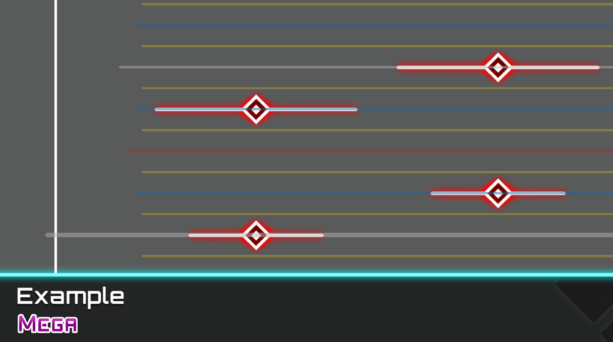

# Advanced Features

This page explains the advanced editing features included in DyNode.

## Commands

You can use the built-in console and a series of editing commands in DyNode to perform quick and advanced operations on your chart.

Press <kbd>.</kbd> or <kbd>/</kbd> to open the console.

Opening the console with different keys will add different prefixes, `.` and `/`, to the command.

- If the finally executed command has a `.` prefix, the console will close immediately after the command is executed, allowing you to quickly perform continuous editing operations on the chart.
- If the finally executed command has a `/` prefix, the console will not close after the command is executed.
- The finally executed command can also have no prefix.

A command consists of a command name and a variable number of command arguments. Different commands may require different numbers of arguments. If you need to use a command, you need to check its **name**, the required **number and type of arguments**, and its **effect**. You can also use the command's **abbreviation** instead of its name. The command arguments and name must be **separated by spaces**.

A command may also have multiple **variants**, which may require different numbers of arguments and have different effects.

Below is a list of all available commands and their details, described in the following basic format.
```
.<command_name> <required_arg1> <required_arg2> ... [optional_arg1] [optional_arg2] ... 
    // Effect of the command
    .<abbreviation1>
    .<abbreviation2>
    ...
```

Different command variants will be described as different commands, but their abbreviations will not be repeated.

Additionally, if a command has a variant with only one argument, and that argument is a real number, the following command format is also recognized. This allows you to quickly enter shorter commands.
```
.<command_name><argument1>
```
For example:
```
.w1.5   // Change the width of selected notes to 1.5
.p2.5   // Change the position of selected notes to 2.5
.s2     // Change the side of selected notes to the right side
```

If you enter more arguments than the maximum number of arguments for the matched variant, the extra arguments will be appended to the last argument, separated by spaces. This is convenient for entering commands that require a single string argument. You can also enclose the content to be recognized as a single argument in double quotes.

You can use <kbd>↑</kbd> / <kbd>↓</kbd> to quickly navigate to previously used commands.

You can use <kbd>ESC</kbd> or `.q` to close the console.

### Quick Start
:::tip
If you need to quickly get started with the command feature, here is a guide to help you understand the basics.
:::

You can follow the steps below to quickly batch-modify notes to your desired width.

1. Select the notes you want to modify.
2. Press the <kbd>.</kbd> key.
3. Enter `w1.5`. Or change `1.5` to any value you want.
4. Press Enter.

You can follow the steps below to quickly generate a curve among the selected notes in chronological order and fill it with notes.

1. Select the notes on the same side that you want to connect.
2. Press the <kbd>.</kbd> key.
3. Enter `lin` or `cub`.
4. Press Enter.

:::center



:::

:::tip Regarding Curve Command Variants

You can also enter `lin8`. Here, `8` represents the overriding beat subdivision. At this subdivision, the filled notes will be 32nd notes. By default, the curve generation command will use your current beat subdivision.

Alternatively, enter `lin tap`. Here, `tap` represents the type of note you want to fill with.

These two arguments can be in any order. You can enter `lin 8 tap` or `lin tap 8`.

However, `lin8 tap` is not allowed. The short command format only supports single-argument variants.

:::

### Basic Property Editing

You can use the following series of commands to quickly edit the basic properties of selected notes.

```
.width <real_number>
    // Change the width of selected notes
    .w
    .wid

.position <real_number>
    // Change the position of selected notes
    .p
    .pos

.side <0|1|2|any_integer>
    // Change the side of selected notes. 0 - Front; 1 - Left; 2 - Right.
    // You can also enter any integer, which will be mapped to a value between 0 and 2.
    .s

.time <real_number>
    // Change the time of selected notes, in milliseconds
    .t
```

### Curve Filling

You can use the following series of commands to generate curves for the selected notes and smoothly fill notes between them along the beat lines.

```
.linear <variable_arguments>
    // Curve Filling - Linear
    .lin
.cosine <variable_arguments>
    // Curve Filling - Cosine
    .cos
.cubic <variable_arguments>
    // Curve Filling - Natural Cubic Spline
    .cub
.catrom <variable_arguments>
    // Curve Filling - Centripetal Catmull-Rom Spline
    .crom
```

These commands will take all your selected notes, sort them by time, generate a curve from this sequence, and then smoothly fill notes between them.

All the commands above share the same arguments and effects; they only differ in the curve generation algorithm used.

Your selected notes must be on the **same falling side**.

You can append any number of arguments to the commands above. They will be applied in order to this curve generation.
- If an argument is an integer `x`, it will override your current beat subdivision setting. The filled notes will be `4*x`-th notes.
- If an argument is a note type, the filled notes will be of the type you selected.
  - TAP: represented by `tap` / `normal` / `note`.
  - SLIDE: represented by `slide` / `chain`.
  - HOLD: represented by `hold`.
  - If you don't use this argument, the note type for a curve fill segment will be copied from the note type at the head of that curve.

For example, `.cubic slide 8` means to fill with SLIDE notes between the selected notes using a natural cubic spline curve at a 32nd note subdivision.

:::center

:::

### Batch Advanced Operations

You can use the following series of commands to perform advanced operations on notes.

#### Snap Command

The `snap` command allows you to batch-fix offset notes to the correct time points.

```
.snap [pre|post|nearest]
    // Batch snap all selected notes to the beat lines.
    // The argument determines the target beat line for snapping.
    // `pre` is the default value when no argument is provided.
```

Different arguments determine the snapping target.
- `pre`: Each note will snap to the nearest preceding beat line.
- `post`: Each note will snap to the nearest succeeding beat line.
- `nearest`: Each note will snap to the closest beat line.

#### Duplicate and Deduplicate Commands

The `duplicate` command allows you to perform multiple batch quick duplications rapidly. This is equivalent to using the quick duplicate function several times consecutively on selected notes.

```
.duplicate [integer]
    // Batch duplicate selected notes to the next beat line after the latest note.
    // The optional argument specifies the number of times to repeat this operation.
    .dup
```

The `deduplicate` command allows you to quickly deduplicate selected or all notes. For all notes with identical properties, this command will only keep one.

```
.deduplicate
    // Deduplicate selected or all notes.
    .dedup
```

#### Other Commands

```
.center
    // Move the selected notes so that their leftmost and rightmost ends are symmetrically centered.
    .cen

.purge
    // Delete all notes.

.fix
    // Fix common errors with notes.
    // - Fix out-of-bounds notes by moving all out-of-bounds notes back within the boundaries.

.expr <expression>
    // Execute an expression on the selected notes. See the guide's [Advanced Editing/Expressions] for details.
    .e
```

### Miscellaneous Commands

```
.echo <string>
    // Output a line of content.

.quit
    // Close the console
    .q
```

## Expressions

Press <kbd>0</kbd> to input an expression.

A valid expression is a meaningful statement composed of a series of operators, numbers, and variables, for example: `a=10+b*c`, `100>90`, etc.

Expressions support the basic arithmetic operators `+,-,*,/,%`, bitwise operators `<<,>>,|,&`, logical operators `&&,||,!`, relational operators `>,<,>=,<=,==,!=`, and the assignment operator `=`.

You can write expressions in a C-like syntax. Some valid expression examples are as follows:

```cpp
a=(10+20)*30     // a becomes 900
b=a              // b becomes 900
b=a=20           // b is assigned (a=20), right-associative
c=10*20/20       // c becomes (10*20)/20, left-associative
```

You can use expressions to batch modify the properties of all notes or selected notes.

The currently supported note property variables are listed in the table below:

| Property |                       Function                        | Unit  | Note Type Restriction |
| :------: | :---------------------------------------------------: | :---: | :-------------------: |
|   time   |               The time the note occurs                |  ms   |                       |
|   pos    |               The position of the note                |       |                       |
|   side   | The falling side of the note (0-Front/1-Left/2-Right) |       |                       |
|   wid    |                 The width of the note                 |       |                       |
|   len    |               The duration of the note                |  ms   |         HOLD          |
|  htime   |         The head time of the note (for Hold)          |  ms   |         HOLD          |
|  etime   |         The tail time of the note (for Hold)          |  ms   |         HOLD          |

The expression is computed independently on each note. The computation process is as follows:
* The expression’s variables are initialized based on the note’s properties.
* The expression is evaluated, and the variables may change during computation.
* The final values of the variables are used to update the note’s properties.

In DyNode, multiple expressions are separated by `;` and are executed sequentially. All variables are stored as double‐precision floating-point numbers.

Note that some variables are restricted to certain note types; that is, they only affect specific types of notes. All computations will ignore SUB type notes (the tail notes of HOLD notes). See [Modifying HOLD Properties](#modifying-hold-properties) for details.

Specifically, the falling side property (`side`) will always be taken modulo 3. For example, setting `side` to `1`, `4`, or `-2` is equivalent.

Below are some valid examples of expressions, each on a separate line:

```cpp
wid = wid * 2                       // Double the width of the note
pos = 2.5                         // Set the note position to 2.5
time = time + 10                    // Increase the note time by 10ms (adding delay)

pos = 2 * 2.5 - pos                  // Mirror the note across the center at position 2.5
time = time / 1.5; len = len / 1.5   // Speed up the chart by a factor of 1.5 (divide note times and HOLD durations by 1.5)
a = 20; time = a                    // Define variable a and assign it to time

side = side + 1                     // Moves front notes to the left, left notes to the right, and right notes to the front
pos = (side == 0) * 2 + (side != 0) * pos   // Only changes the position of front notes to 2
side = -side                        // Swaps the left and right side notes
```


### Modifying HOLD Properties

All expression evaluations ignore SUB type notes. Instead, for HOLD type notes there are special property variables available:

| Property |         Function          | Unit  |
| :------: | :-----------------------: | :---: |
|   len    | The duration of the note  |  ms   |
|  htime   | The head time of the note |  ms   |
|  etime   | The tail time of the note |  ms   |

This means that modifying the `time` property of a HOLD note will not affect its duration; changing `time` effectively moves the entire HOLD note rather than adjusting its head and tail separately.

If you want to modify the head and tail separately, you need to change the `htime` and `etime` properties instead of `time`.

You may notice that these three properties can conflict; that is, if you modify `htime` and `etime`, then `len` would theoretically change. However, during expression evaluation, variables are not bound to each other – a change in one does not automatically update another.

In practice, we do not recommend including two HOLD-related variables in the same expression. The conflict resolution is as follows:
* If both `time` and `htime` are modified, the modification to `htime` takes precedence.
* If both `len` and `etime` are modified, the modification to `len` takes precedence.

Here are some valid examples of modifying HOLD properties:

```cpp
htime = htime + 10; etime = etime - 10       // Increase the head time by 10ms and decrease the tail time by 10ms for all HOLD notes
len = len / 2                                // Halve the duration of all HOLD notes
htime = 100                                  // Set the head time of all HOLD notes to 100ms
htime = 100; len = 100                        // Equivalent to setting time and duration to 100ms
```
