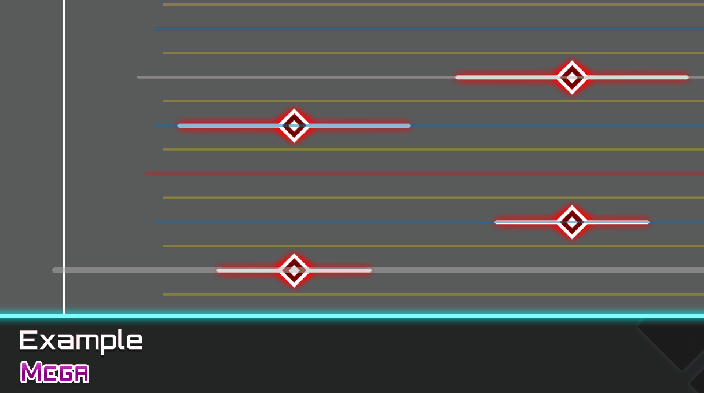
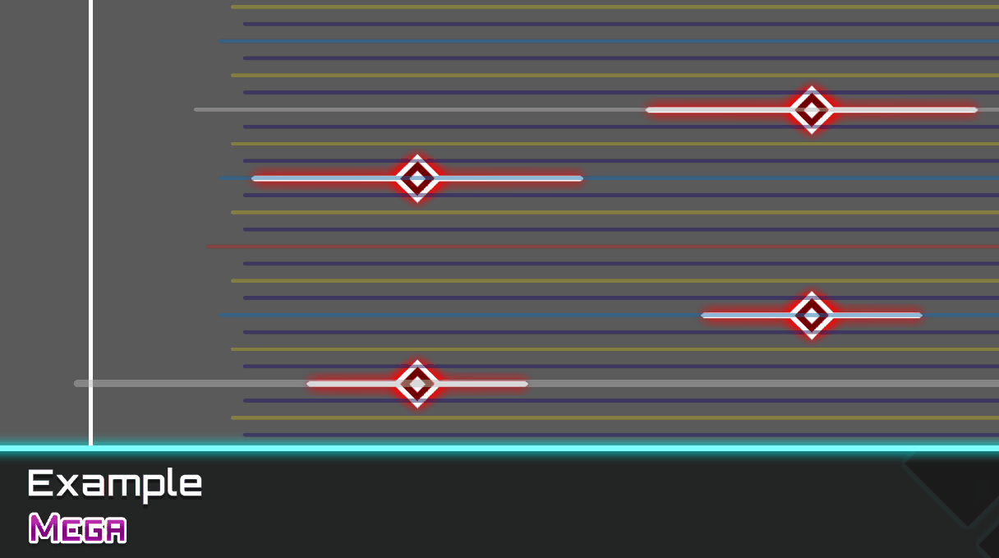
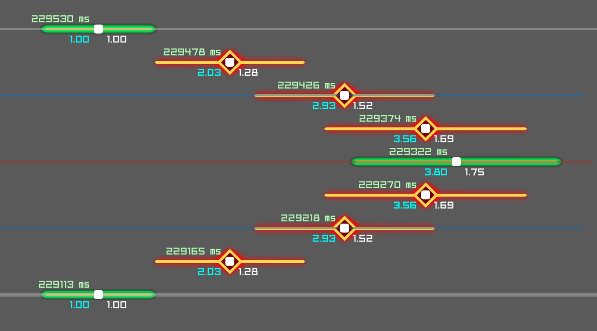
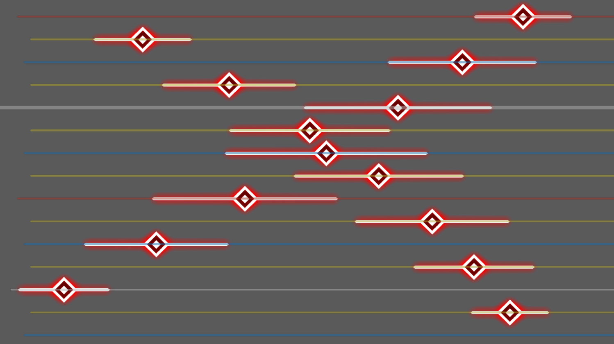

# 高级功能

本页面讲解 DyNode 包含的进阶编辑功能。

## 命令

你可以通过 DyNode 内置的控制台与一系列编辑命令来对谱面进行快捷和高级的操作。

使用 <kbd>.</kbd> 或 <kbd>/</kbd> 来打开控制台。

使用不同的键位打开控制台会为命令添加不同的前缀 `.` 与 `/` 。

- 如果最终执行的命令前缀为 `.`，则命令执行完毕之后控制台将会立即关闭，便于你快速对谱面进行连续的编辑操作。
- 如果最终执行的命令前缀为 `/`，则命令执行完毕之后控制台将不会关闭。
- 最终执行的命令也可以不具有前缀。

一条命令由命令名称与不定长的命令参数组成。不同的命令可能要求不同的参数数量。如果你需要使用某个命令，你需要查看命令的**名称**、要求的**参数数量和类型**以及其**效果**。你也可以使用命令的**缩写**来代替命令的名称。命令参数和命令名称必须通过**空格分隔**。

一条命令也可能有多种**变体**，不同的变体会要求不同的参数数量，并可能具有不同的效果。

下面将会列出所有可用的命令及其详情，命令将以下面的基本格式进行描述。
```
.<命令名称> <必需参数1> <必需参数2> ... [可选参数1] [可选参数2] ... 
    // 命令的效果
    .<命令的缩写1>
    .<命令的缩写2>
    ...
```

不同的命令变体在描述时将被视为不同的命令，但不会重复其缩写。

额外地，如果一个命令具有仅一个参数的变体，且这个参数是一个实数，那么下面的命令格式也是可被识别的。这方便你快速输入较短的命令。
```
.<命令名称><参数1>
```
例如：
```
.w1.5   // 修改选中音符宽度为 1.5
.p2.5   // 修改选中音符位置为 2.5
.s2     // 修改选中音符所在侧面为右侧
```

如果你输入的参数大于匹配到的最大参数数量的变体，则多出来的这些参数会被拼接到最后一个参数上，以空格分隔。这方便你输入需求单个字符串参数的命令。你也可以使用双引号将需要被识别为单个参数的内容包含起来。

你可以使用 <kbd>↑</kbd> / <kbd>↓</kbd> 来快速跳转到你曾经使用过的命令。

你可以使用 <kbd>ESC</kbd> 或 `.q` 来关闭控制台。

### 快速上手
:::tip
如果你需要快速上手命令功能，则下面是一个供你简单了解命令作用的指南。
:::

你可以通过下面的操作来快速批量地修改音符到你想要的宽度值。

1. 选中你想要修改的音符。
2. 按下 <kbd>.</kbd> 键。
3. 输入 `w1.5`。或者将 `1.5` 修改为你想要的任意值。
4. 按下回车键。

你可以通过下面的操作来快速地在选中的音符之间按时间顺序排列生成曲线并用音符进行填充。

1. 选中你想要进行连接的同一侧面的音符。
2. 按下 <kbd>.</kbd> 键。
3. 输入 `lin` 或 `cub`。
4. 按下回车键。

:::center



:::

:::tip 关于曲线命令变体

你也可以输入 `lin8`。其中 `8` 代表覆盖的节拍细分。在这一细分下，填充的音符将是 32 分音符。默认情况下，曲线生成指令将使用当前你正在使用的节拍细分。

或者输入 `lin tap`。其中 `tap` 代表你想要填充的音符类型。

这两个参数可以以任意顺序排列。你可以输入 `lin 8 tap`，也可以输入 `lin tap 8`。

但 `lin8 tap` 是不行的。短命令格式仅支持一个参数的变种。

:::

### 基本属性编辑

你可以使用下面的一系列命令快速编辑选中音符的基本属性。

```
.width <实数>
    // 修改选中音符的宽度
    .w
    .wid

.position <实数>
    // 修改选中音符的位置
    .p
    .pos

.side <0|1|2|任意整数>
    // 修改选中音符的所在侧面。0 - 正面；1 - 左侧；2 - 右侧。
    // 你也可以输入任意整数，它们最终会被映射到一个0到2之间的值。
    .s

.time <实数>
    // 修改选中音符的时间，以毫秒为单位
    .t
```

### 曲线填充

你可以使用下面的一系列命令对选中的音符生成曲线并在音符与音符之间的节拍线上平滑地填充音符。

```
.linear <可变参数>
    // 曲线填充 - 线性
    .lin
.cosine <可变参数>
    // 曲线填充 - 余弦
    .cos
.cubic <可变参数>
    // 曲线填充 - 自然三次样条
    .cub
.catrom <可变参数>
    // 曲线填充 - 向心 Catmull-Rom 样条
    .crom
```

这些命令将获取你选中的所有音符并将它们按照时间排列，按这一序列生成曲线之后再在音符与音符之间进行平滑的填充。

上面的所有命令都共享同样的参数和效果，它们只有使用的曲线生成算法不同。

你选中的音符必须处于**同一下落面**。

你可以为上面的所有命令附带任意长度的参数。他们将按顺序作用于本次的曲线生成上。
- 如果参数是一个正整数 `x`，则它将覆盖你正在使用的节拍细分设置。填充的音符将会是 `4*x` 分音符。
- 如果参数是一个负整数 `-x`，则它将覆盖你正在使用的节拍间隔设置。
  - 将从第一个音符的下 `x` 个节拍线开始放置音符，随后在放置音符后的下 `x` 个节拍线放置第二个音符，直到超过本段的最后一个音符为止。
  - 间隔设置默认为 `1`。
- 如果参数是一个音符类型，则填充的音符将会是你选择的音符类型。
  - TAP: 使用 `tap` / `normal` / `note` 表示。
  - SLIDE: 使用 `slide` / `chain` 表示。
  - HOLD: 使用 `hold` 表示。
  - 如果你没有使用这个参数，则一段曲线填充的音符类型将从这段曲线头部的音符类型进行复制。

例如，`.cubic slide 8` 代表使用 SLIDE 音符在选中的音符之间按自然三次样条生成的曲线以 32 分音符进行填充。

:::center

:::

`.cubic 8 -2` 使生成的音符两两间隔一个 32 分音符。这使你可以交错地生成曲线。

:::center

:::

### 批量高级操作

你可以使用下面的一系列命令对音符进行高级操作。

#### 吸附指令

`snap` 指令方便你批量修复偏移的音符到正确的时间点上。

```
.snap [pre|post|nearest]
    // 将选中的所有音符批量吸附到拍线上。
    // 参数决定吸附的拍线对象。
    // pre 为无参数时的默认值。
```

不同的参数将决定吸附的目标。
- `pre` 每一个音符都将吸附到所在时间的前一个最近拍线上。
- `post` 每一个音符都将吸附到所在时间的后一个最近拍线上。
- `nearest` 每一个音符都将吸附到离所在时间最近的拍线上。

#### 复制与去重指令

`duplicate` 指令可以使你快速地多次批量进行快速复制。这一功能等价于对选中的音符连续使用多次快速复制功能。

```
.duplicate [整数]
    // 将选中的音符批量复制到最晚音符的下一个节拍线上。
    // 可选的复制次数表示将该功能重复执行多次。
    .dup
```

`deduplicate` 指令可以使你快速地对选中或所有音符进行去重指令。对所有具有同样属性的音符，该指令将只保留其中的一个音符。

```
.deduplicate
    // 对选中或所有的音符进行去重。
    .dedup
```

#### 其它指令

```
.center
    // 移动选中的音符，使其最左端和最右端居中对称。
    .cen

.purge
    // 删除所有音符。

.fix
    // 修复有关音符的常见错误。
    // - 修复出界音符，将所有出界音符移动到界内。

.expr <表达式>
    // 对选中的音符执行表达式。详见指南的[高级功能/表达式]。
    .e
```

### 杂项指令

```
.echo <字符串>
    // 输出一行内容。

.quit
    // 关闭控制台
    .q
```

## 表达式

使用 <kbd>0</kbd> 或通过 `.expr` / `.e` 命令来输入表达式。

一个合法的表达式是由一系列运算符、数字、变量与函数排列组合构成的一个有意义的式子，例如：`a=10+b*c`，`100>90`等。

表达式支持基本的四则运算符 `+,-,*,/,%`，位运算符 `<<,>>,|,&`，逻辑运算符 `&&,||,!`，关系运算符 `>,<,>=,<=,==,!=`，赋值 `=` 等。

通过 `函数名(参数1, 参数2, ...)` 的方式来调用函数。例如 `sin(0)`，`pow(2,3)` 等。

你可以以符合直觉的方式以类似C语言的语法来撰写该表达式，一些合法的表达式例子如下：

```cpp
a=(10+20)*30        // a=900
b=a                 // b=900
b=a=20              // b=(a=20)，右结合
c=10*20/20          // c=(10*20)/20，左结合

a=rand(5)           // rand(5) 的结果是 [0,5] 内的任意实数
b=pow(2,3)          // b=8, pow(2,3) 的结果是 2 的 3 次方，即 8
c=sin(0)+cos(0)     // c=1
```

你可以通过表达式的计算来批量修改全部音符/选中音符的属性。

当前支持的属性变量见下表：

|  属性  |                            作用                             | 单位  | 音符限制 |
| :----: | :---------------------------------------------------------: | :---: | :------: |
|  time  |                       音符所在的时间                        |  ms   |          |
|  bar   |                  音符所在的 Bar（小节数）                   |       |          |
|  abar  |             音符所在的 Bar 绝对值，**只写变量**             |       |          |
|  pos   |                       音符所在的位置                        |       |          |
|  side  |          音符所在的下落侧（0-正面/1-左侧/2-右侧）           |       |          |
|  wid   |                         音符的宽度                          |       |          |
| index  |  当前处理的音符在所有被处理的音符序列中的位置，从0开始计数  |       |          |
|  bpm   |   包含音符所在时间的 TimingPoint 的 BPM 值，**只读变量**    |       |          |
| meter  |  包含音符所在时间的 TimingPoint 的 meter 值，**只读变量**   |       |          |
| tptime | 包含音符所在时间的 TimingPoint 的头部所在时间，**只读变量** |       |          |
|  len   |                       音符的持续时间                        |  ms   |   HOLD   |
| htime  |                     音符头部的所在时间                      |  ms   |   HOLD   |
| etime  |                     音符尾部的所在时间                      |  ms   |   HOLD   |

这些属性变量的修改将与音符的属性实时绑定。因此，一部分变量的修改可能会同时影响其他变量的值：例如修改 `htime` 或 `etime` 将会同时影响 `time` 与 `len`；而 `time` 和 `bar` 的修改将实时互相影响各自的值... 以此类推。

`index` 是一个特殊的变量。表达式将对你选中的音符按照时间、位置的优先级从小到大排列（时间越小则越先被处理），而后第一个被处理的音符的 `index` 变量即为 `0`，第二个被处理的音符的 `index` 变量即为 `1` ... 以此类推。这是一个**只读变量**。

:::tip 关于只读/只写变量
无法在表达式中修改只读变量/读取只写变量的值。修改只读变量/读取只写变量的值会使表达式执行报错。
:::

:::tip 关于 bar/abar 属性
这个属性方便你通过小节数来直接移动音符到目标时间上，而无需经过复杂的 BPM 换算。

例如，`bar = bar + 3/16` 将使音符向后移动 3 个 16 分音符，而 `bar = bar + 2 + 3/28` 将使音符向后移动两个小节又 3 个 28 分音符。

这个属性同时支持跨 Timing Point 的计算，因为此属性**在写入时**并非基于**绝对值**进行运算。
* 其基于**相对值**进行运算，即 bar 的变化量。
  * 获取 bar 的变化量之后，音符的移动将会跳过 Timing Point 中不存在的 bar 值，使其可以方便的使用诸如此类 `+3/16` 等移动操作。
  * 若你不知道什么是**绝对值**，它即为 DyNode 意义下的绝对小节数。详见 [Timing/时间与小节数](timing.md#时间与小节数) 。你也可以通过 <kbd>Ctrl+B</kbd> 或白色小节线右侧的数字来看到绝对小节数。
* 因此，使用 `bar = 20` 等直接赋值大概率将不会使你得到想要的结果。

如果需要使用绝对值的写入，需使用 `abar` 变量。`abar` 是一个**只写**变量，专门用于绝对小节数的修改。
:::

当前支持的函数和内置变量见下表：

|          函数          |                                   作用                                   |
| :--------------------: | :----------------------------------------------------------------------: |
|      `pow(a, b)`       |                           返回 `a` 的 `b` 次方                           |
|        `sin(x)`        |                        返回 `x` 的正弦值（弧度）                         |
|        `cos(x)`        |                        返回 `x` 的余弦值（弧度）                         |
|    `step(edge, x)`     |               阶跃函数，若 `x >= edge` 返回 1，否则返回 0                |
|  `clamp(x, min, max)`  |                    将 `x` 限制在 `min` 和 `max` 之间                     |
|        `exp(x)`        |                        返回自然常数 e 的 `x` 次方                        |
|       `floor(x)`       |                             对 `x` 向下取整                              |
|       `ceil(x)`        |                             对 `x` 向上取整                              |
|       `round(x)`       |                             对 `x` 四舍五入                              |
|       `rand(x)`        |                      返回 `[0, x]` 范围内的随机实数                      |
|     `randr(l, r)`      |                      返回 `[l, r]` 范围内的随机实数                      |
|       `irand(x)`       |                      返回 `[0, x]` 范围内的随机整数                      |
|     `irandr(l, r)`     |                      返回 `[l, r]` 范围内的随机整数                      |
|       `btt(bar)`       |                      将绝对小节数转换为绝对时间毫秒                      |
|      `ttb(time)`       |                      将绝对时间毫秒转换为绝对小节数                      |
| `tabd(time, deltaBar)` | 获取绝对时间毫秒移动 `deltaBar` 个小节后的绝对时间，并跳过不存在的小节段 |

| 变量  |              描述               |
| :---: | :-----------------------------: |
| `pi`  | 只读常量，返回圆周率 π 的精确值 |

`bar`、`abar`、`bpm`、`meter`、`tptime`、`btt`、`ttb`、`tabd` 均要求正确设置 Timing Point。若不存在任何 Timing Point，表达式将执行失败。

表达式在每个音符上的计算是独立的。表达式计算的过程可以概括如下：
* 根据音符的属性初始化表达式的变量。
* 计算表达式，中途表达式的变量产生变化。
  * 在这过程中，音符的属性也会实时地随着表达式的变量产生变化。
* 将被修改后的最终的音符属性应用到谱面的实际音符上。

在 DyNode 中，输入的表达式以 `;` 分隔，他们将依次按顺序执行。变量的存储类型为双精度浮点数。

特别的，一些变量存在音符限制，这意味着他们只在一部分音符上能够生效。所有表达式的计算都将忽略 SUB 类型的音符（HOLD 尾部音符），详见 [HOLD 属性的修改](#hold-属性的修改) 。

特别的，下落侧的属性（side）最终总会对 3 取模。举例而言，将 `side` 设置为 `1`，`4` 或 `-2` 是等价的。

下面是一些表达式的合法实例，其中一行代表一个例子：

```cpp
wid=wid*2                       // 音符的宽度翻倍
pos=2.5                         // 音符的位置全部设置为2.5
time=time+10                    // 音符的所在时间+10ms（添加音符延迟）

pos=2*2.5-pos                   // 将音符按照屏幕的中线进行对称（屏幕中线的位置为2.5）
time=time/1.5;len=len/1.5       // 谱面1.5倍速（所有音符的时间除以1.5，所有HOLD的长度除以1.5）
a=20;time=a                     // 定义变量a，并将a赋值给time

side=side+1                     // 正面音符移动到左侧，左侧音符移动到右侧，右侧音符移动到正面
pos=(side==0)*2+(side!=0)*pos   // 仅修改正面音符的位置为2
side=-side                      // 将左右侧音符进行交换
```


### HOLD 属性的修改

所有表达式的计算都将忽略 SUB 类型的音符，取而代之的是针对 HOLD 类型的音符存在一些特殊的属性变量。

| 属性  |        作用        | 单位  |
| :---: | :----------------: | :---: |
|  len  |   音符的持续时间   |  ms   |
| htime | 音符头部的所在时间 |  ms   |
| etime | 音符尾部的所在时间 |  ms   |

这意味着当你修改 HOLD 的 `time` 属性时，它实际不会修改 HOLD 的持续时间，也即修改 `time` 意味着将 HOLD 进行整体的移动而非头部与尾部分别进行修改。

如果你想实现头部与尾部分别进行修改，你需要修改 `htime` 与 `etime` 属性，而非 `time` 属性。

修改这三个属性将可能使这三个属性的值同时产生变化，即若你修改了 `htime` 或 `etime`，那么 `len` （以及 `time`）也都会实时地发生变化。

:::tip
当在一个表达式里面同时修改这些属性时，由于表达式按顺序执行每一个表达式，他们并不会在修改上产生冲突。

例如下面的例子：

`etime=etime-10; time=time+10`

其含义为：
* **先**修改尾部的绝对时间为-10
* **后**移动整体音符到+10
  * 这一操作将同时使 etime 和 htime +10，但由于表达式并非并行执行而是按顺序执行，该操作与上一操作并不会产生冲突。
* 最终 htime 相对于原来增加了 10，而 etime 相对于原来没有变化。
:::

:::tip 我想在 Hold 专有的属性中也使用 bar，怎么办？
对其他的时间修改需求，你可以使用函数 `btt` / `ttb` / `tabd` 来进行小节数与时间的绝对 / 相对转换。

`bar` 与 `abar` 实际上也只是一种对以上函数的包装。
:::

下面是一些合法的修改 HOLD 属性的表达式例子：

```cpp
htime=htime+10;etime=etime-10       // 所有HOLD音符的头部时间+10，所有HOLD音符的尾部时间-10
len=len/2                           // 所有HOLD的持续时间除以2
htime=100                           // 修改所有HOLD音符的头部时间为100
htime=100;len=100                   // 等价于 time=100;len=100
```